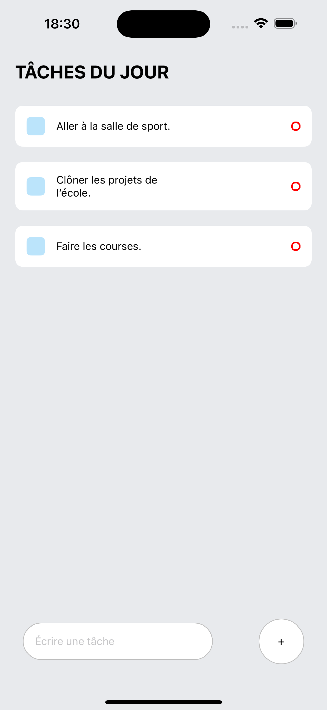

# ToDoList Native Expo

## Description du Projet

Ce projet est une application de liste de tâches développée avec Native Expo. Elle permet aux utilisateurs de créer, gérer et suivre leurs tâches quotidiennes de manière simple et efficace. Fonctionnelle sur iOS et Android.

## But du Projet

L'objectif principal de ce projet est de fournir une application mobile intuitive et facile à utiliser pour aider les utilisateurs à organiser leurs tâches et à améliorer leur productivité. Il s'agit d'un simple projet annexe réalisé à l'aide d'un tutoriel youtube. 

## Améliorations Prévues

- **Notion de délais** : Ajouter la possibilité de définir des délais pour chaque tâche.
- **Notifications Push** : Ajouter des notifications pour rappeler aux utilisateurs leurs tâches à venir.
- **Thèmes Personnalisables** : Offrir des options de personnalisation de l'interface utilisateur avec différents thèmes.

## Installation

1. Clonez le dépôt : `git clone https://github.com/jmsjrz/ToDoList_NativeExpo.git`
2. Naviguez dans le répertoire du projet : `cd ToDoList_NativeExpo`
3. Installez les dépendances : `npm install`
4. Lancez l'application : `expo start`

## Contribution

Veuillez soumettre une pull request ou ouvrir une issue pour discuter des changements que vous souhaitez apporter.
